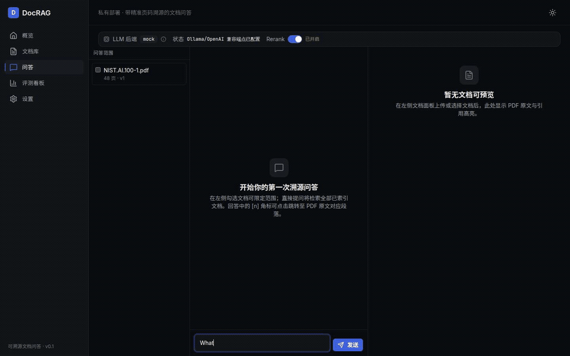
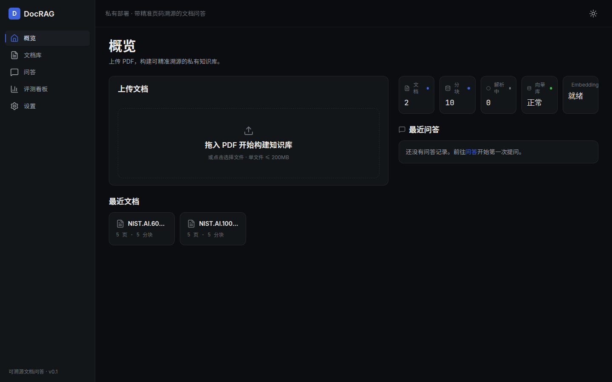
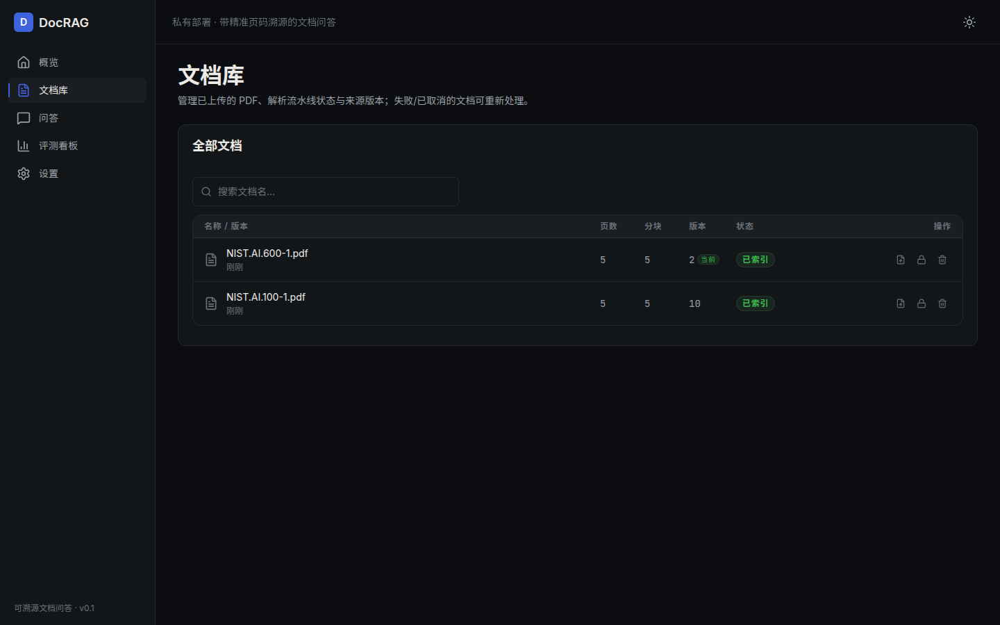
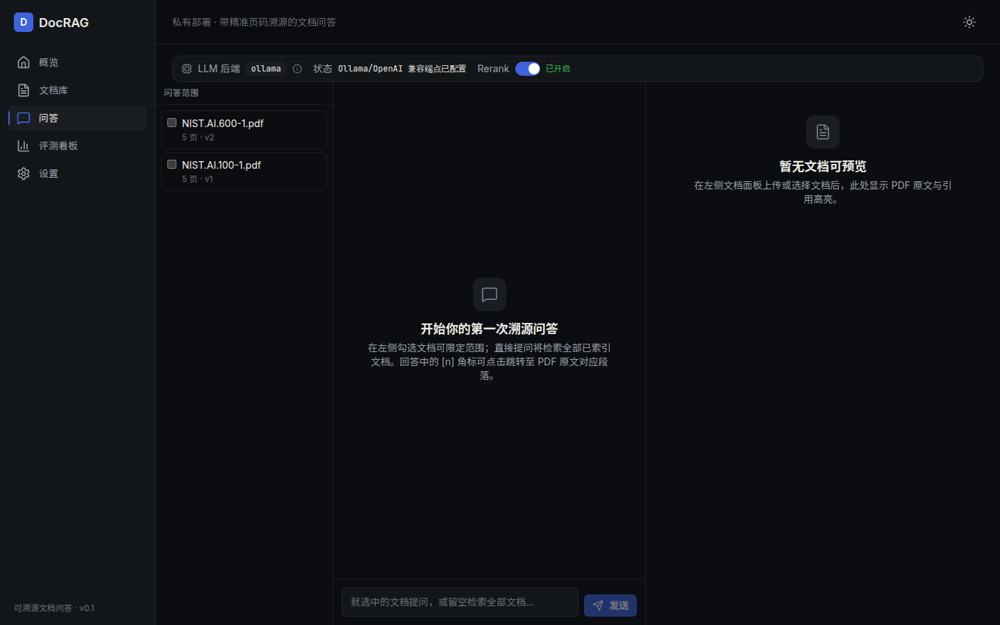
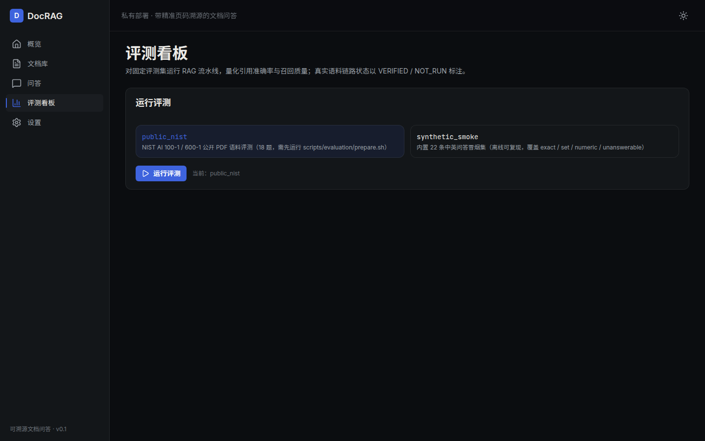
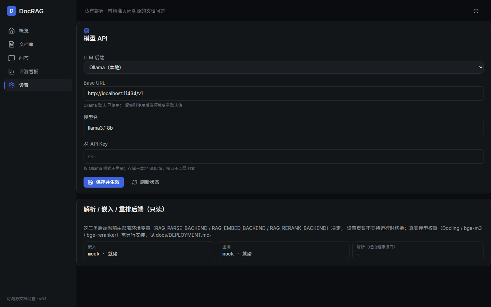
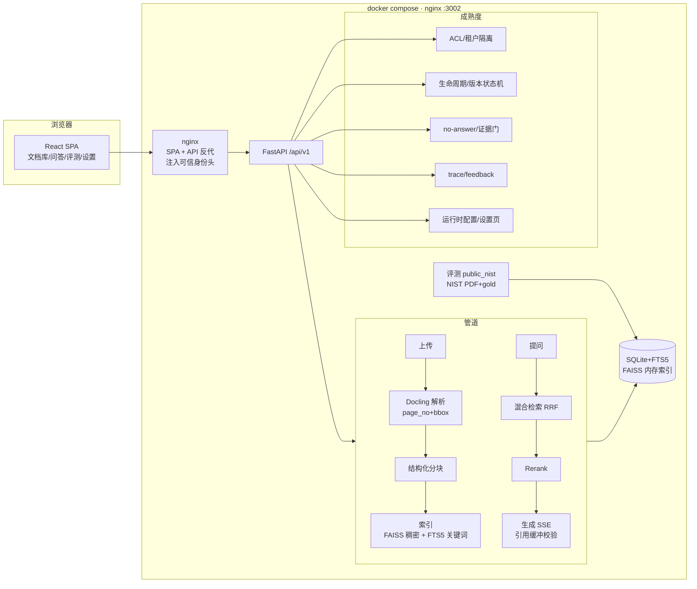

# DocRAG — 可私有部署的文档 RAG Web 应用

**本地私有、零外部依赖的 PDF 文档问答系统** —— 从 PDF 上传到带页码引用的回答，一条 `docker compose` 起全套。


> PDF 上传 → Docling 解析（保留页码溯源）→ 结构化分块 → 向量(SQLite+FAISS) + 关键词(SQLite FTS5) 混合检索 → Rerank → 带精准页码引用的回答 → PDF 原文预览。默认本地 Ollama、可切 OpenAI 兼容 API（前端设置页运行时配置，无需改环境变量）。

<details>
<summary>📑 目录</summary>

- [功能一览](#功能一览)
- [界面预览](#界面预览)
- [架构](#架构)
- [快速开始](#快速开始)
- [评测（量化检索质量）](#评测量化检索质量)
- [可观测性](#可观测性)
- [项目结构](#项目结构)
- [常见问题 FAQ](#常见问题-faq)
- [工程说明](#工程说明)

</details>

---

## 最新动态

- **2026-08-12** 真实 Docling 解析链路在容器内 VERIFIED（NIST 报告 48 页真实摄取，mock 仅 5 页）；检索消融对比（BM25 / 稠密 / 混合 / 混合+重排）与失败案例分析入库；评测质量门禁上线（CI 云端实测通过）
- **2026-08-12** 成熟度升级：租户 ACL、文档版本生命周期、无答案状态、反馈与追踪、设置页运行时模型配置；76 项后端测试全绿
- **2026-08-12** 公开评测集上线：2 份 NIST 报告（SHA-256 校验）+ 18 题页码/证据 gold，无密钥基线 Recall@5 0.844 / MRR 0.747（bootstrap+Wilson 95% CI）

## 界面预览

**端到端演示（真实 NIST 语料 + Docling 解析）**：提问 → SSE 流式回答 → 点击引用 → PDF 原文跳页高亮：



| 概览 | 文档库（生命周期/版本/ACL/重试） |
|---|---|
|  |  |

| 问答（多来源范围/SSE 阶段/引用） | 评测看板（public_nist + 消融对比） | 设置（模型 API 运行时配置） |
|---|---|---|
|  |  |  |

## 功能一览（对应需求 F1–F10 + 成熟度扩展）

| 编号 | 功能 | 说明 |
|------|------|------|
| F1 | PDF 上传 + Docling 解析 | 解析结果保留 `page_no` 与 `bbox` 坐标，支撑像素级溯源 |
| F2 | 结构化分块 | 按文档结构边界切分，每块携带溯源元数据（页码/章节/坐标） |
| F3 | 混合检索 | 稠密向量（FAISS）+ 关键词（FTS5）双路召回，RRF(k=60) 融合 |
| F4 | Rerank | bge-reranker-v2-m3 本地精排，默认开启、不可静默跳过 |
| F5 | 带页码引用回答 | 双后端 LLM（Ollama / OpenAI 兼容，env 切换），回答内联 `[n]` 引用，引用携带 sourceId/version/title/createdAt |
| F6 | PDF 原文预览 + 高亮 | pdf.js 渲染，点击引用跳页并按 `bbox` 高亮段落；答案可导出 JSON v1（不可变 source manifest） |
| F7 | 多语言嵌入 | bge-m3（dense+sparse 一体），中英混合开箱可用（评测含 2 条中文跨语言题） |
| F8 | Docker 零依赖部署 | 单 compose 启动，无外部服务依赖；另有隔离验收栈 `docrag-acceptance`（`manage.sh` 一键管理） |
| F9 | 版本化评测 | 默认 `public_nist`：2 份 NIST 公开 PDF / 18 题（16 answerable + 2 unanswerable，含 2 条中文跨语言题）+ 自建页码 gold（非 NIST 官方 benchmark）；Recall/Precision/Hit@K、MRR、nDCG、引用与答案指标、bootstrap/Wilson CI、四维切片、provenance（真实模型 NOT_RUN）；旧 22 条手写问答为 `synthetic_smoke` |
| F10 | 多文档管理 | 上传列表、删除（同步清理向量/FTS 条目）、8 态状态机（含 warning/failed/cancelled）、cancel/retry 原子认领 |
| F11 | 文档生命周期与版本 | source_id + version + is_active/archived_at；索引成功才发布新版本（旧版归档）；版本列表与替换入口 |
| F12 | ACL 与租户隔离 | 租户 + 属主/组/管理员两级权限，fail-closed（无权限 404/空结果）；身份经可信反向代理注入（`RAG_TRUSTED_PROXY`），浏览器不可伪造；ACL 管理与撤权即时生效 |
| F13 | 无答案状态 | 检索无有效证据 → `no_answer(no_evidence)`（不调 LLM）；生成无有效引用 → `no_answer(not_supported)`；无支撑内容绝不泄出 |
| F14 | 反馈与追踪 | 答案反馈（rating + 问题类型 + 评论）、`GET /trace/{id}` 管道追踪（证据/引用/阶段耗时/模型 provenance）；query 原文不落库 |

**明确不做**（MVP 范围外）：用户认证（OIDC/SSO，身份由可信反向代理注入）、GraphRAG、Agent / 工具调用、扫描件深度 OCR、移动端原生 App。完整成熟度审计见 [`docs/MATURITY_MATRIX.md`](docs/MATURITY_MATRIX.md)。

---

## 架构

```
浏览器 (React SPA)
   │  /api/v1  (nginx 反代)
   ▼
FastAPI 网关
   ├─ 上传 → ParseService(Docling: page_no+bbox)
   │         → ChunkService(HybridChunker, 溯源元数据)
   │         → IndexService(bge-m3 dense→SQLite BLOB + FAISS; keyword→FTS5)
   ├─ 提问 → RetrieveService(FAISS top-k + FTS5 top-k → RRF top-20)
   │         → RerankService(bge-reranker → top-5)
   │         → GenerateService(LLM SSE 流式, 带 [n] 引用)
   └─ 可观测性：结构化 JSON 日志 + /api/v1/metrics（计数器与延迟直方图）
存储：SQLite(元数据+FTS5+向量BLOB) + FAISS(内存索引) + 模型权重 + PDF 原件
```

完整分层图、数据流、混合检索与时序见 [`docs/architecture.md`](docs/architecture.md)。
规格契约（API/DB/页面/Token/验收标准）见 [`docs/SPEC.md`](docs/SPEC.md)。
文档索引与关键事实速查（0 歧义）见 [`docs/README.md`](docs/README.md)。



---

## 技术栈

| 层 | 选型 |
|----|------|
| 前端 | React 19 + Vite 8 + TypeScript 5.6 + Tailwind CSS 4 + Radix UI + lucide-react（SVG 图标，禁 emoji）+ pdfjs-dist 6 |
| 后端 | FastAPI 0.115 + Pydantic 2.11 + Uvicorn |
| 解析 | docling 2.117（DocumentConverter + HybridChunker，prov 透传 page_no+bbox） |
| 嵌入 | BAAI/bge-m3（FlagEmbedding，dense+sparse 一体） |
| 向量 | SQLite(BLOB) + FAISS 1.14.3（IndexFlatIP，归一化后 = cosine） |
| 关键词 | SQLite FTS5（trigram，≤2 字中文 LIKE 兜底） |
| 重排 | BAAI/bge-reranker-v2-m3（本地 CrossEncoder） |
| 融合 | RRF(k=60) |
| LLM | openai SDK + base_url 切换（Ollama 默认 / OpenAI 兼容） |
| 部署 | 单 docker-compose（nginx 托管前端 + 反代 API，backend 独立服务） |

---

## 快速开始

### 方式一：Docker 一键部署（推荐）

```bash
cd docrag
docker compose up --build
# 访问 http://localhost:3002
```

默认以 **MOCK 后端** 启动，可完全离线端到端演示（解析/嵌入/重排/LLM 均走确定性 mock，不下载大模型）。切换到真实模型见 [`docs/DEPLOYMENT.md`](docs/DEPLOYMENT.md)。

隔离验收栈（不与原卷冲突）：

```bash
./scripts/docker/manage.sh build      # docker compose -f docker-compose.acceptance.yml build
./scripts/docker/manage.sh up         # 起栈 → http://127.0.0.1:3302（health 就绪）
./scripts/docker/manage.sh status     # 状态/health
./scripts/docker/manage.sh down       # 停栈（不带 -v，保留 draccept_* 数据卷）
```

### 方式二：本地开发

```bash
# 后端
cd backend
python -m venv .venv && source .venv/bin/activate
pip install -r requirements.txt -r requirements-dev.txt -r requirements-eval.txt
cp .env.example .env   # 可选：开启 MOCK 以便离线运行
uvicorn app.main:app --reload --port 8000

# 前端（另开终端）
cd frontend
npm install
npm run dev            # http://localhost:5173
```

---

## 评测（量化检索质量）

默认评测集 `public_nist`（2 份 NIST 公开 PDF / 103 chunk / 18 题：16 answerable + 2 unanswerable，gold 为自建页码证据，**非 NIST 官方 benchmark**）：

```bash
# 一次性准备：下载+校验 PDF（SHA-256）→ 构建语料 → 验证 gold（fail-closed）
bash scripts/evaluation/prepare.sh
# 运行确定性评测（报告原子写入 work/eval_reports/public_nist_report.json）
bash scripts/evaluation/run.sh
# 容器内运行（子命令直传：prepare / run / verify）
./scripts/docker/manage.sh eval run
# 浏览器：评测看板页 http://localhost:3002/evaluation（默认 public_nist，可选 synthetic_smoke）
```

指标：**Recall/Precision/Hit@K + hard-negative**、**MRR**、**nDCG@K**、**引用页精度/召回**、**答案 EM/F1**（exact/set/rubric/numeric 容差/弃答）、**bootstrap/Wilson 95% CI**、**language/answer_type/tag/document 四维切片**；报告含 provenance（真实模型适配器本轮全部 NOT_RUN）与确定性自检。数字与口径见 [`docs/BENCHMARK_CARD.md`](docs/BENCHMARK_CARD.md)，协议见 [`docs/EVALUATION_PROTOCOL.md`](docs/EVALUATION_PROTOCOL.md)。旧 22 条内嵌问答为 `synthetic_smoke`（`python -m app.evaluation.runner`）。

### 主基线结果（2026-08-12，BM25 + 词法重排 + 抽取式答案，无密钥）

| 指标 | recall@1 | recall@5 | MRR | nDCG@5 | 引用召回 | 答案 EM/F1 | 弃答 |
|------|---------|---------|-----|--------|---------|-----------|------|
| 值 | 0.625 | 0.844 | 0.747 | 0.754 | 0.844 | 0.062 / 0.070 | 0.0 |

### 检索消融对比（同一指标口径，四路变体）

| 变体 | recall@1 | recall@5 | MRR | nDCG@5 |
|------|---------|---------|-----|--------|
| BM25 + 词法重排 | **0.625** | **0.844** | **0.747** | **0.754** |
| mock 稠密（确定性 mock 嵌入） | 0.344 | 0.594 | 0.440 | 0.469 |
| RRF 混合（BM25 + mock 稠密） | 0.500 | 0.750 | 0.641 | 0.663 |
| 混合 + 词法重排 | 0.625 | 0.750 | 0.703 | 0.709 |

> 诚实口径：mock 稠密是确定性哈希信号，不是语义嵌入——其弱于词法检索不构成真实 bge-m3 的结论（真实嵌入/重排/LLM 本轮 `NOT_RUN`，见 BENCHMARK_CARD §6.1/§10）。失败案例分析（抽象定义/中文跨语言/多页答案/弃答识别）见 BENCHMARK_CARD §6.2。

成熟度六卡（矩阵/数据卡/基准卡/协议/复现/验证）见 [`docs/MATURITY_MATRIX.md`](docs/MATURITY_MATRIX.md) 起。

---

## 可观测性

- **结构化日志**：所有日志为 JSON 单行（时间/级别/模块/消息/上下文字段），便于容器采集。
- **指标端点**：`GET /api/v1/metrics` 暴露进程内计数器与延迟直方图：
  - 计数器：`document_uploads_total`、`documents_indexed_total`、`documents_failed_total`、`queries_total`、`citations_returned_total`、`errors_total`
  - 直方图：`http_request_latency_ms`、`pipeline_latency_ms`、`retrieve_latency_ms`、`llm_latency_ms`
- **健康检查**：`GET /api/v1/health`、`GET /api/v1/config/backends`（LLM/Embedding/Rerank 就绪状态）。

---

## 项目结构

```
docrag/
├── backend/                 # FastAPI 后端
│   ├── app/
│   │   ├── api/             # 请求封装（无，路由直接暴露于 routes）
│   │   ├── core/            # embeddings / faiss_store / parser / reranker / llm / logging / metrics
│   │   ├── repositories/    # 数据访问（SQLite + FTS5）
│   │   ├── routes/          # documents / search / chat / meta / evaluation
│   │   ├── services/        # pipeline / document / index / retrieve / rerank / generate / citation
│   │   ├── evaluation/      # dataset.json + runner（指标计算）
│   │   └── tests/           # smoke + 评测测试
│   ├── requirements.txt     # 运行时依赖（精简）
│   ├── requirements-dev.txt # 开发/测试依赖
│   └── Dockerfile
├── frontend/                # React SPA
│   ├── src/
│   │   ├── components/      # common / layout / ui（单一职责，单文件 ≤300 行）
│   │   ├── pages/           # Home / Documents / Chat / Evaluation
│   │   ├── api/ lib/ hooks/ # 请求封装 / 工具 / 状态
│   │   └── design/         # DESIGN.md + design-tokens.json（双主题 Token）
│   └── Dockerfile + nginx.conf
├── docs/                    # SPEC.md / architecture.md / ENGINEERING.md / DEPLOYMENT.md
│                            # + 成熟度六卡：MATURITY_MATRIX / DATA_CARD / BENCHMARK_CARD
│                            #   / EVALUATION_PROTOCOL / REPRODUCE / VALIDATION
└── docker-compose.yml       # 单 compose 起全套（默认 MOCK）；验收栈 docker-compose.acceptance.yml
```

---

## 设计语言

克制暗色（dark-first）+ 完整 light 第二主题；单一精炼靛蓝 `#3E63DD` 强调，琥珀 `#F5B544` 专用于 PDF 页码引用高亮。图标全 Lucide（SVG），零 emoji、零紫粉渐变、零硬编码色（全部 Design Token）。详见 `frontend/src/design/DESIGN.md`。

---

## 工程说明

关键设计决策、技术权衡、验证状态与已知边界见 [`docs/ENGINEERING.md`](docs/ENGINEERING.md)。

## 工程纪律

- 分层架构（routes → services → repositories），依赖只向下；入口零业务逻辑。
- 单文件 ≤ 300 行；P0 红线：禁 emoji 图标、禁紫粉渐变、禁硬编码色与模板味文案。
- 测试与文档驱动：每个 Phase 产出落盘，三文档（PRD / 技术选型 / 设计方向）经用户确认后生成 Spec 契约。

---

## 常见问题 FAQ

<details>
<summary><b>完全离线可用吗？</b></summary>

可以。默认 MOCK 模式零外部依赖（解析/嵌入/重排/LLM 全部确定性 mock，不下载任何权重），一条 compose 即可演示全链路；真实 Docling 解析在 acceptance 镜像档已容器内验证（48 页真实摄取）。接入真实 LLM 只需在设置页填后端/Base URL/Key。
</details>

<details>
<summary><b>支持哪些文档格式和语言？</b></summary>

当前为 PDF（Docling 结构化解析，保留页码与 bbox 溯源）；语言上中英混合开箱可用，公开评测集含 2 条中文跨语言题。扫描件深度 OCR 属于明确不做项（见功能一览）。
</details>

<details>
<summary><b>为什么用 SQLite + FAISS 而不是向量数据库？</b></summary>

单机私有部署场景下，SQLite 提供元数据/FTS5/向量 BLOB 一体化事务，FAISS 提供内存 ANN 检索，零外部服务依赖。已知边界：单 SQLite 写连接串行化，多 worker 共享向量库属于待产品化项（见 docs/ENGINEERING.md）。
</details>

<details>
<summary><b>评测数字是真的吗？</b></summary>

是。评测用 2 份 NIST 公开报告 PDF（SHA-256 校验、DOI、NIST Open License）+ 18 题自建页码/证据 gold，基线无密钥可复现，报告两次运行字节一致（确定性自检），并在 GitHub Actions 中作为质量门禁每次运行。真实 bge-m3/重排/LLM 链路明确标注 `NOT_RUN`，mock 不冒充真实模型质量（见 docs/BENCHMARK_CARD.md）。
</details>

<details>
<summary><b>如何接入 OpenAI 兼容 API？</b></summary>

打开「设置」页 → LLM 后端选 OpenAI 兼容 API → 填 Base URL / 模型名 / API Key → 保存即生效（无需改环境变量或重建镜像）。API Key 只存本地 SQLite 且接口不回显明文。
</details>

<details>
<summary><b>与 RAGFlow / Dify / privateGPT 有什么不同？</b></summary>

DocRAG 定位是轻量可私有部署的文档问答产品：零外部依赖一条 compose 起全套、引用精确到页码+bbox 高亮、内置可复现公开评测与质量门禁。它不做低代码编排（Dify）或平台级任务流（RAGFlow），代码量小、易读易改，适合作为自托管知识库起点。
</details>

## 工程说明
