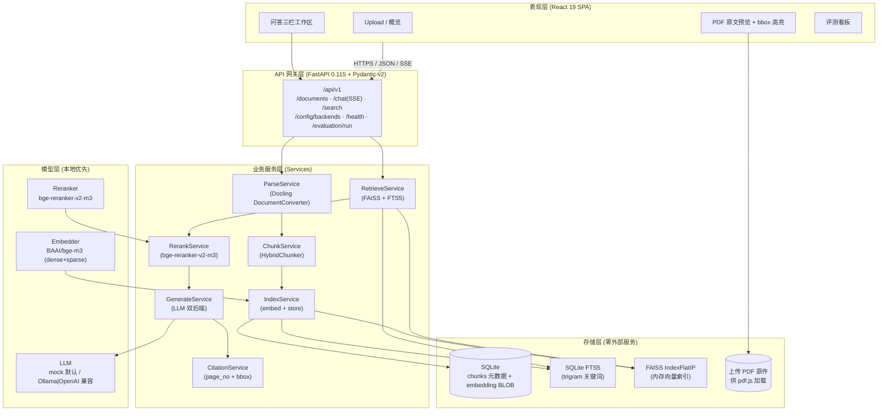
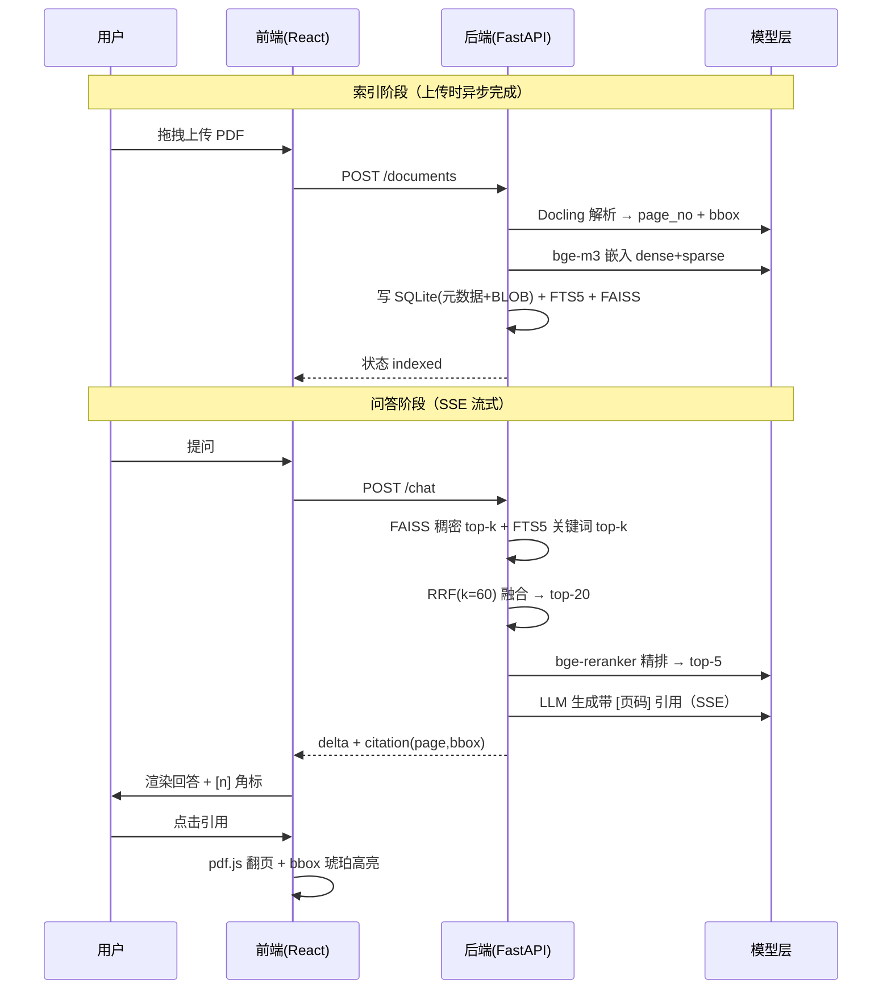
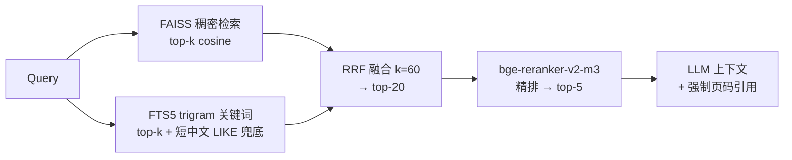
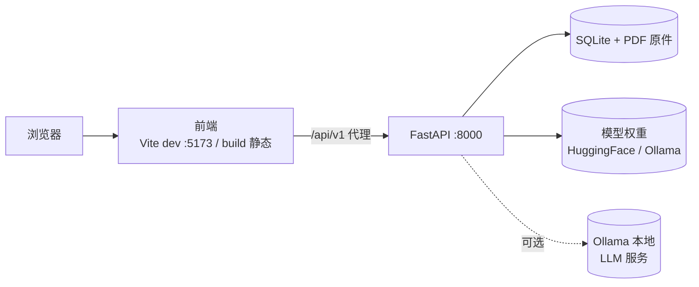
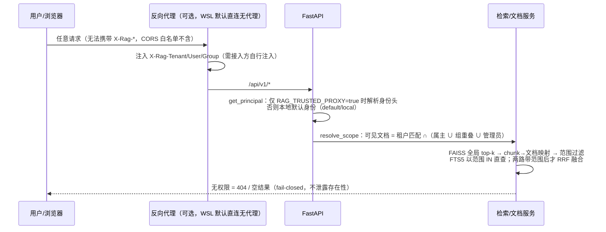

# DocRAG 系统架构

> 文档 RAG Web 应用（DocRAG）— 可本地部署、带精准页码溯源
> 技术栈：React 19 + Vite + FastAPI + Docling + bge-m3 + FAISS/SQLite + bge-reranker + pdf.js

## 1. 分层架构图



## 2. 核心数据流（一次问答）



## 3. 混合检索与重排



## 4. 部署拓扑

运行环境唯一为 **WSL（Ubuntu）** 原生；Docker 已弃用并移除，无容器/nginx 反代。



- 后端：`backend/.venv/bin/python -m uvicorn app.main:app --port 8000`（MOCK 用 `./start_mock.sh`）。
- 前端：`frontend` 下 `npm run dev`（开发，Vite 代理 `/api` 到 8000）或 `npm run build` 产出静态文件。
- 数据/模型：项目目录下由 `RAG_DATA_DIR`/`RAG_DB_PATH`/`RAG_MODEL_DIR` 指定。

## 5. 身份与 ACL 数据流（成熟度扩展）



- 管理操作（删除 / ACL 修改 / cancel / retry / 版本替换）要求属主或管理员（`auth.doc_manageable`）。
- trace 读取同样按租户/用户 ACL 过滤；query 原文与可反查哈希一律不落库。

## 6. 文档生命周期状态机（成熟度扩展）

```text
                       ┌──────────────┐
                       ▼              │  retry（原子认领）
queued → parsing → chunking → embedding → indexed（active，可替换新版本）
   │         │          │          │
   │         └──────────┴──────────┴──→ failed（清理 partial chunks）
   │                        │
   │                        └─────────→ warning（部分成功，分块保留可检索）
   └───────────────────────────────────→ cancelled（终态；仅瞬态可取消，冲突 409）
```

- 版本：`source_id + version + is_active + archived_at`；新版本 `version=MAX+1`、`is_active=0`，**索引成功才 promote** 归档旧版（失败不替换）。
- 重启恢复：瞬态（queued/parsing/chunking/embedding）→ `failed`（reason=`service_restart_interrupted`）+ 清理 partial（`document_service.recover_interrupted`，main.py lifespan 调用）。
- 每次状态流转写 `document_events` 审计表（from_status/to_status/reason/is_transient）。

## 7. 评测架构（版本化评测，成熟度扩展）

```mermaid
flowchart LR
    subgraph DS["数据层（datasets/nist_ai_rmf_public_v1）"]
        MAN[manifest.json<br/>DOI/SHA-256/页数/许可/content_start_page]
        QS[questions.jsonl<br/>18 题 + gold_pages/evidence + rubric/numeric]
    end
    subgraph E["评测模块（app/evaluation/）"]
        PD[public_dataset<br/>下载校验/提取/语料/gold 验证 fail-closed]
        BA[baselines<br/>BM25 + 词法重排 + 抽取式答案]
        EM[eval_metrics<br/>指标 + bootstrap/Wilson CI + 四维切片]
        PR[public_runner<br/>prepare | run | verify + 确定性自检]
    end
    subgraph OUT["产物（work/）"]
        CACHE[(source_cache/*.pdf)]
        CORPUS[eval_corpus.json<br/>103 chunk]
        REPORT[eval_reports/public_nist_report.json]
    end
    MAN --> PD --> CACHE
    QS --> PD
    PD --> CORPUS --> BA --> EM --> REPORT
    QS --> EM
    REPORT --> API[POST /evaluation/run<br/>默认 profile public_nist<br/>未 prepare → 409]
    API --> EVALS[(evaluations 表)]
```

- 硬规则：gold 只作评估输入，绝不进入检索/生成管线（`run_baseline` 仅用 query；有守护测试）。
- 报告含 `provenance`（docling/embedding/reranker/llm 四适配器，真实模型大多 NOT_RUN）与 `determinism.verified`（去除 created_at 后字节一致）。
- 本地执行：`scripts/evaluation/{prepare,run,gate}.sh`（CI 与本地通用，读写 `work/`）与 `POST /api/v1/evaluation/run`。

## 8. 关键设计决策

| 决策 | 选型 | 为什么（权衡） |
|------|------|----------------|
| 页码溯源 | Docling `prov.page_no + bbox` | 解析即带坐标，全链路透传，做到像素级高亮跳转，而非语义模糊引用 |
| 向量存储 | SQLite(BLOB) + FAISS | 零外部服务、单文件；>100万 chunk 才需 IVF（非 MVP） |
| 关键词检索 | SQLite FTS5 trigram | 中英子串零依赖；1–2 字中文 LIKE 兜底 |
| 融合 | RRF(k=60) | 异构分数（cosine/BM25）免标定融合，鲁棒 |
| 重排 | bge-reranker-v2-m3 本地 | 多语言、零 API 成本、默认开启不可静默降级 |
| 嵌入 | bge-m3 dense+sparse | 100+ 语言、中英混合开箱即用、sparse 免费作第二信号 |
| LLM 双后端 | openai SDK + base_url | Ollama/OpenAI 零代码分支切换，默认本地离线 |
| 预览高亮 | pdf.js + bbox 视口映射 | 前端渲染、可文本选中、零服务端转换 |
| 图标/主题 | Lucide + Token 双主题 | P0 禁 emoji、禁紫粉渐变，工程级可维护 |
| 身份与 ACL | 可信反向代理注入 X-Rag-* 头 + Principal(租户/用户/组) | 无认证体系仍可租户隔离；浏览器无法伪造身份头；fail-closed 不泄露存在性 |
| 生命周期 | 8 态状态机 + document_events 审计 + 原子认领（cancel/retry） | 无竞态、可审计；重启恢复瞬态→failed |
| 版本 | source_id + version + promote 后归档 | 失败的新版本不污染线上（旧版保持 active）；无回滚（产品决策） |
| 无答案 | 生成内容缓冲 + 引用校验后才泄出 | 无有效证据（no_evidence）不调 LLM；无有效引用（not_supported）不泄出 delta |
| 评测 | 无密钥确定性基线 + CI + 切片 + provenance | 零密钥可复现、置信边界透明；真实模型适配器状态显式标注（NOT_RUN 不冒充验证） |
